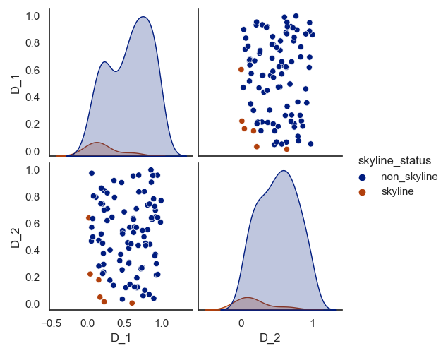
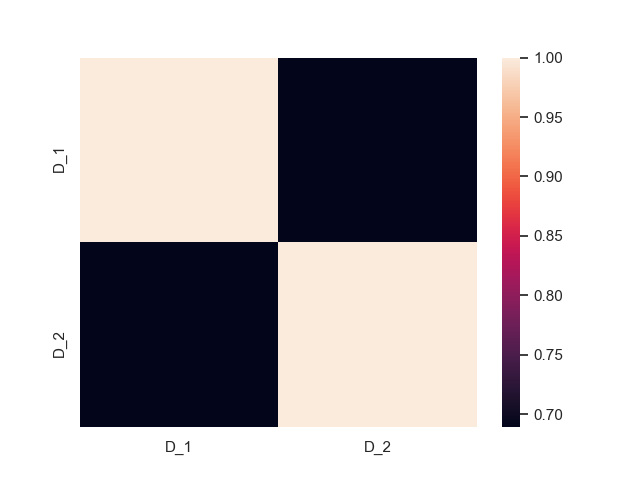
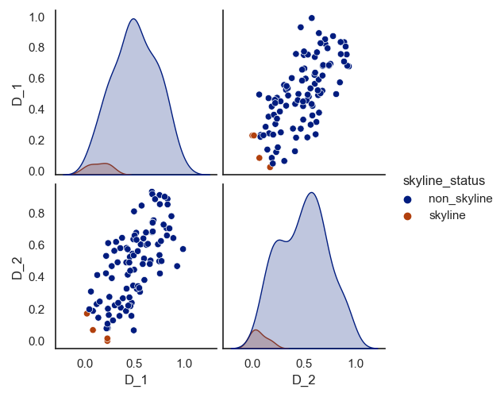
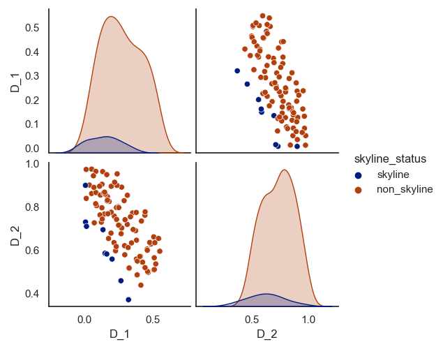

# Dataset-Generator
Generated multi-dimensional correlated, anti-correlated and independent datasets as specified in "Borzsony, S., Kossmann, D., &amp; Stocker, K. (2001, April). The skyline operator. In Proceedings 17th international conference on data engineering (pp. 421-430). IEEE." (well, almost)

## Method

This code is capable of generating 3 kinds of datasets - `INDEP` (independent), `CORR` (correlated) and `ANTI` (anti-correlated) datasets. The domain of each attribute / dimension is from $[0, 1)$. The code needs to be provided with the dimensionality and cardinality of the dataset to be generated. 

- `INDEP` - every attribute is distributed independently of every other attribute. A uniform distribution is used to generate values

- `CORR` - every attributed is correlated with every other attribute. For each data point, a plane within the unit cube is picked perpendicular to the line connecting points (0,...,0) and (1,...,1) using a normal distribution so that most points are concentrated in the middle of the cube rather than at the ends.  Then another normal distribution centered at the point of contact between the plane and the line is used to generate individual attribute values. In the [paper](The Skyline Operator.pdf), the point generated has to be on the plane, but I found it hard to tweak the parameters to get satisfying results. 

- `ANTI` - at least one pair of attributes are anti-correlated. Similar to the `CORR` case,  a plane is picked perpendicular to the line joining (0,...,0) and (1,...,1). But this time, the normal distribution used to pick the place uses a very small variance so that most planes are picked near the 0.5 mark. To generate a point, a point is picked randomly (uniform distribution) from the plane.

## Instructions

To generate a d-dimensional dataset with n points, parameters need to be passed on the command line from the base directory of this project

```bash
python3 dataset_generator.py <type> <dimensionality> <cardinality>
```

Where `type` can have three values: `INDEP`, `CORR` or `ANTI`

When the command is run, a folder is generated in the `data` folder names `<type>_<dimensionality>_<cardinality>_0.1`. Three files are created in the folder

1. `<type>_<dimensionality>_<cardinality>_0.1.txt` - contains the dataset generated. The contents of the file follow this specified format. `<dp1>` is written as $d$ space-separated floating-point numbers.
```text
<dimensionality>
<cardinality>
0.1
<dp1>
<dp2>
...
```

2. `heatmap.eps` - shows the correlation heatmap of the generated dataset
3. `scatterplot_matrix.eps` - shows scatter plots of every pair of attributes / dimensions

## Examples

| Type | Heatmap | Scatterplot |
|---|---|---|
| `INDEP` |  | |
| `CORR` |  | |
| `ANTI` |  | |

